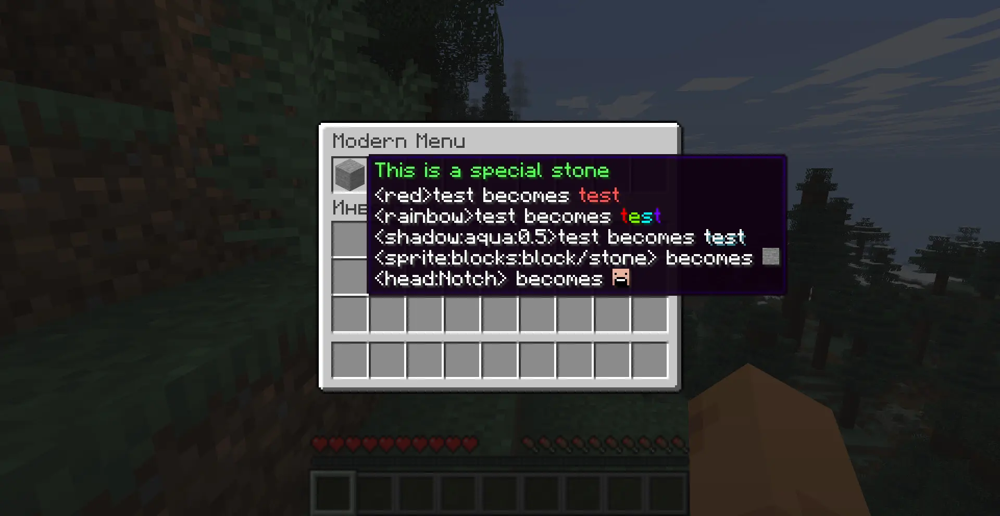

## DeluxeMenus-Modern

A soft fork of [the original DeluxeMenus](https://github.com/HelpChat/DeluxeMenus) with a few improvements:

- **Supports MiniMessage in menu title and items**<br>
  Read further to learn more

- **Designed for Paper 1.16+**<br>
  Does not support environments with no native Adventure support such as Spigot or older Paper

- **Uses a native Adventure API instead of `BukkitAudiences` wrapper**<br>
  May improve performance, especially on modern platforms

- **Uses latest dependencies**<br>
  May improve performance and avoid some bugs

- **Reworked build system**<br>
  Compiles to Java 17 natively and uses the best build conventions

- **Removed update checker**

The goal of this fork is simple — modernize DeluxeMenus without touching too much of the original code, so it stays as
stable as upstream.

> ⚠️ The plugin is still named **DeluxeMenus**, so you can just replace the `.jar` without changing anything.
>
> All configs, all addons etc. everything should be fully compatible

This repository is periodically synced with the upstream project.

## Using MiniMessage

```yml
# ...
menu_title: '<rainbow>My menu'
modern_use_minimessage_for_title: true # <- enables MM in title
# ...
material: STONE
modern_use_minimessage: true # <- enables MM in that item
display_name: "<sprite:items:item/apple> <gradient:green:blue>||||||||||||||||||||||||</gradient> <sprite:items:item/golden_apple>"
lore:
  - "<white>Simple color: <red>IIIIIIIIIIIIII<red> <gray>\\<red>"
  - "<gray>-</gray> <white>HEX color: <color:#00ffbb>IIIIIIIIIIIIII</color> <gray>\\<color>"
  - "<gray>---</gray> <white>Shadow: <white><shadow:aqua:0.8>IIIIIIIIIIIIII</white> <gray>\\<shadow>"
  - "<gray>--</gray> <white>Gradient: <gradient:#00ffbb:#ff9900>IIIIIIIIIIIIII</gradient> <gray>\\<gradient>"
  - "<gray>---</gray> <white>Rainbow: <rainbow>IIIIIIIIIIIIII</rainbow> <gray>\\<rainbow>"
  - "<gray>----</gray> <white>Sprite: <sprite:blocks:block/stone> <gray>\\<sprite>"
  - "<gray>-----</gray> <white>Head: <head:Notch> <gray>\\<head>"
  - "<gray>-----</gray> <white>Font: <font:uniform>IIIIIIIIIIIIII</font> <gray>\\<font>"
  - "<gray></gray><white>Decorations: <white><b>I</b> <i>I</i> <u>I</u> <st>I</st> <obf>I</obf></white>"
```


